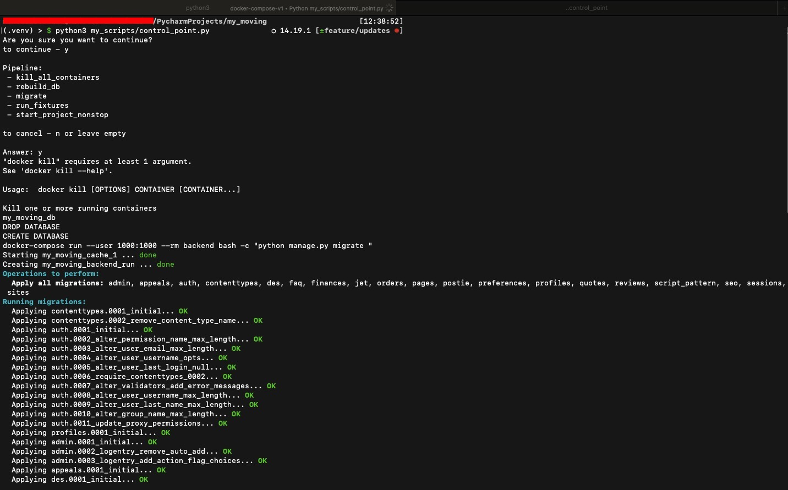
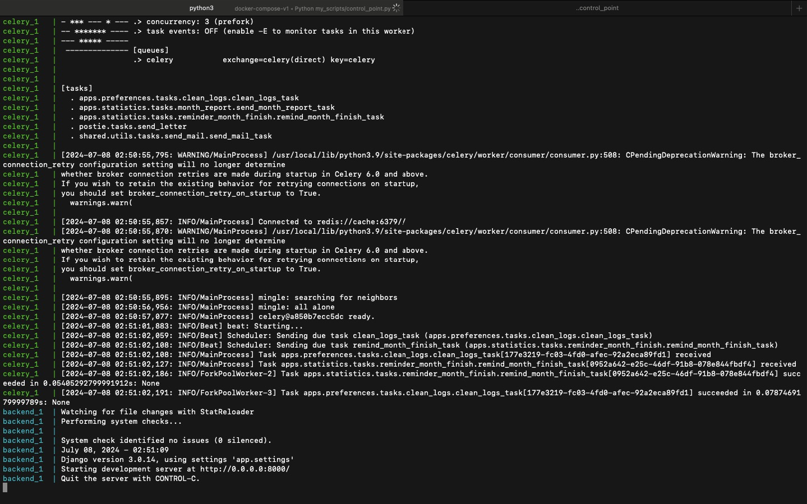

# Docker Control Script

This script, written in Python, provides a set of convenient commands for managing Docker containers and Docker Compose services. It is designed to simplify various tasks such as rebuilding databases, running migrations, loading fixtures, and more, by automating these processes through a unified interface.

## Features

- **Make Commands:** Execute make commands easily.
- **Docker Commands:** Run any Docker command via the script.
- **Docker Compose Commands:** Simplify running Docker Compose commands.
- **Backend Commands:** Specifically tailored commands for backend operations.
- **Pipeline Execution:** Predefined pipeline of commands that can be executed in sequence after confirmation.
- **Manage Migrations:** Automate the creation and deletion of migrations.
- **Database Management:** Rebuild the database, start containers, and load the latest dumps.
- **Install Requirements:** Install project dependencies either locally or via Docker Compose.
- **Run Fixtures:** Load project fixtures into the database.
- **Run Tests:** Execute the test suite.
- **Create Superuser:** Create a Django superuser.
- **Clean Docker Space:** Remove unused Docker containers, images, volumes, and networks.

## Usage

### Running the Script

To run the script, navigate to the project root and execute:
```sh
python3 my_scripts/control_point.py
```

## Screenshots

*Script running*<br>


*Recreated database and applied migrations*


*Created objects from fixtures*


*Local server ready to work*

